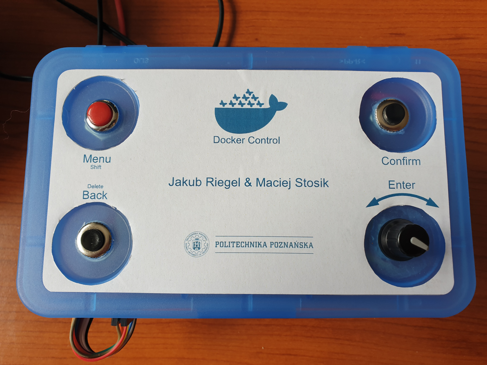
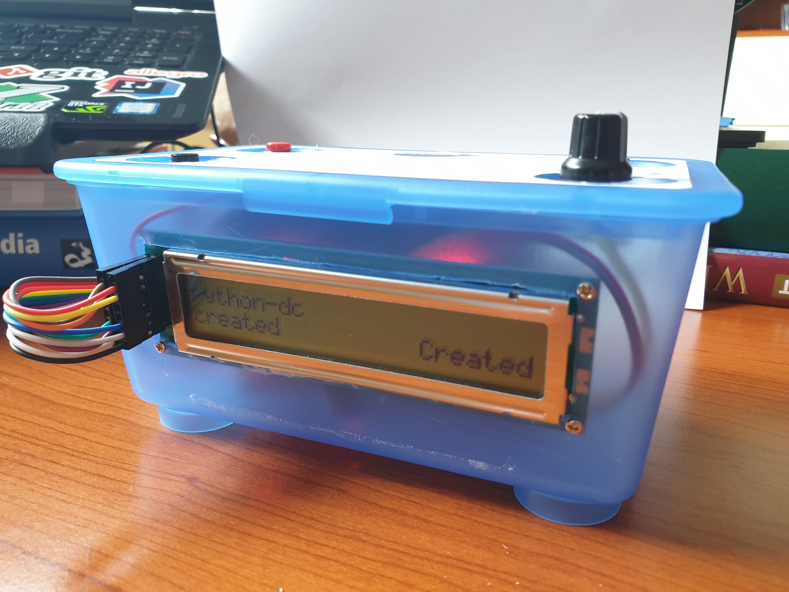
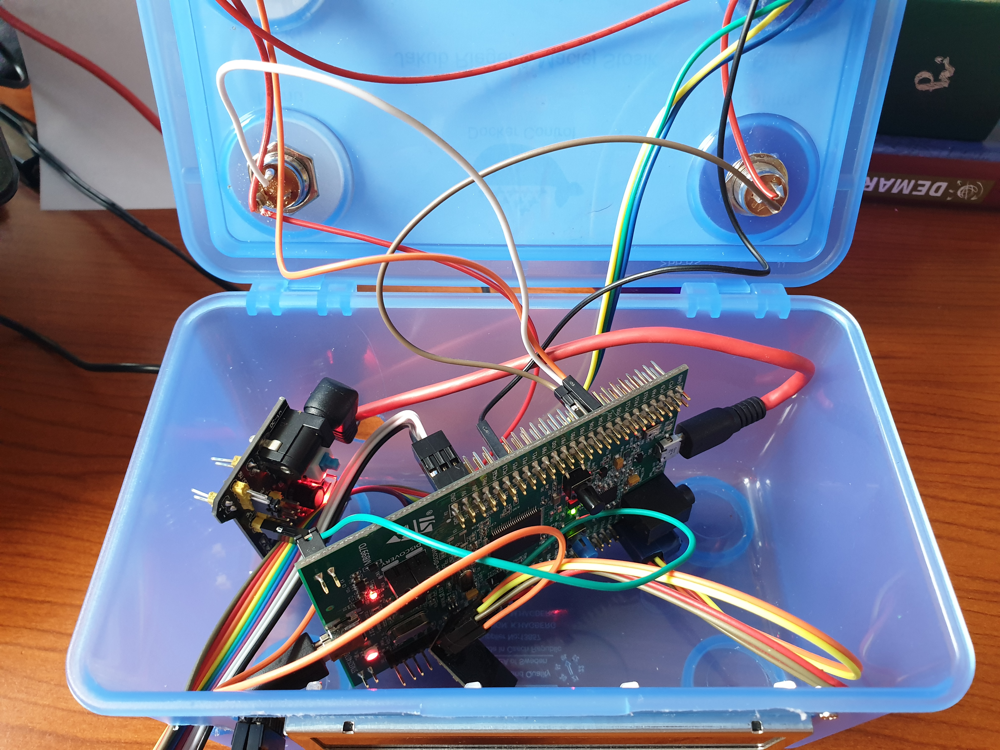
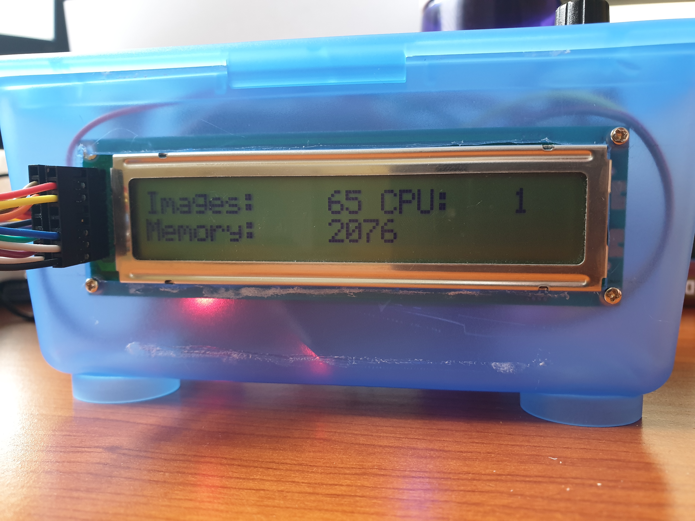
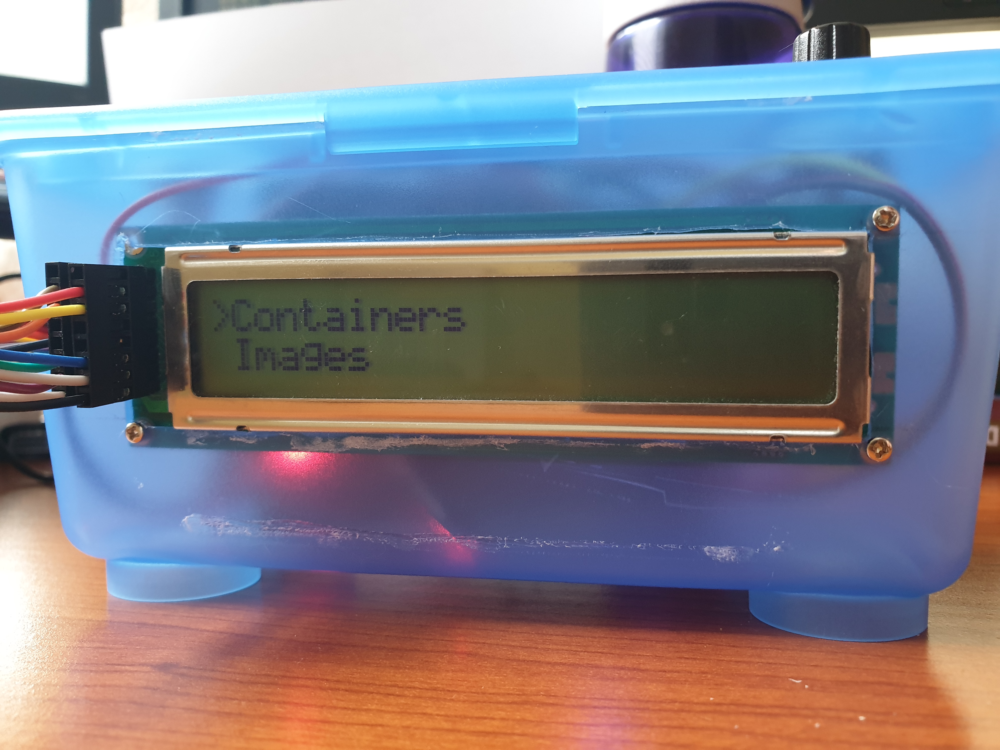

# DockerControl

## overview
Docker Control is a device that allows you to remotely control any Docker instance.

## description
The system consists of two parts: STM device and server application. 

Server application can be run on any Docker instance with dedicated Dockerfile. It connects to Docker and facilitates custom over TCP protocol communication with STM. STM device lets user perform various operations on Docker, get system statistics and alers the user on containers death.

Supported operations are:
* Display all containers
*	Display running containers
* Start container
*	Stop container
*	Restart container
*	Remove container
*	Create container from image
*	Display all images
*	Display stats of system
*	Notify about container death

### server
DockerControlService is a TCP service-like server suppprting custom protocol communication with DockerControl on STM and Docker managment via REST API. The application runs asynchrically and can handle multiple sessions at one time.

### stm
 

### communication
#### protocol
**packet:** `$<sessionId:uint8[3]>!<bodySize:uint12[4]!<cmd:char[4]>!<data?:char[n]>#`

max length: 5006, header: 10 (always), body: 4096 (max)

header: `$<sessionId:uint8[3]>!<bodySize:uint12[4]!` body: `<cmd:char[4]>!<data?:char[n]>#`

#### data representation
**container:** `id:char[64], name:char[50], image:char[50], state:char[10], time:char[10]`

**image:** `image:char[50]`

**stats:** `active_containers:uint[2], paused_containers:uint[2], stopped_containers:uint[2], images:uint[4], cpu:uint[2], memory:uint[6]`

**alert:** `containerId:char[64]`

#### commands
| CMD | data from STM | data from server | notes|
|-----|---------------|------------------|------|
| READ | - | packet with assigned session id and no data | Signals that STM is ready |
| ACKN | - | - | Acknowledge or ping |
| CALL | - | [array of containers] | All containers |
| CACT | - | [array of containers] | Active containers |
| CSTS | [id] | [container] | Stats of container |
| CSTR | [id] | [success],[id] | Start container |
| CSTP | [id] | [success],[id] | Stop container |
| CRST | [id] | [success],[id] | Restart container |
| CRMV | [id] | [success],[id] | Remove container |
| CCRT | [image] | [success] | Create container from image |
| IALL | - | [array of images] | All images |
| SSTS | - | [stats] | Statistics of system |
| ALRT | *sent only from server* | [container_id] | Alerts STM on containers death |
| ERRR | *sent only from server* | error explanation | Signals error on server |

[container] – data of container separated by `,`: `[id],[name],[image],[state],[status]`

[image] – image name with tag (i.e. mongo:latest)

[array of data] – data separated by `;`

[id] – id of a container

[success] – `1` if `true`, `0` if `false`

[stats] - data of stats separated by `,`: `[active],[paused],[stopped],[images],[cpu],[memory]`

## tools
### server
language:  **Kotlin** with [*Ktor*](https://ktor.io/) for networking and [*Jackson*](https://github.com/FasterXML/jackson) for parsing JSON data

other technologies:
* **Gradle** for build automation and dependency managment

### stm
hardware: 
* microcontroller STM32F4407G
* wifi module ESP8266
* lcd screen 24x2
* encoder with button

language:  **C** with *HAL*

other technologies:
* STM Cube MX
* openOCD

## how to compile & run
The file `config.json` on the server and the file `esp_connnection_data.h` on the STM shall be filled with servers and Docker addresse before running the application

### server
#### run locally
`./gradlew run`

### stm
To run this program on STM:
* Make sure to use STM32CubeMX Version 5.0.1
* Generate Code using firmware version STM32Cube FW_F4 V1.22.0
* Import generated code into CLion/Eclipse
* In CLions case Update CMake project with STM32CubeMX project 
* Build and run

### pinout
|   | 0 | 1      | 2      | 3      | 4   | 5      | 6   | 7   | 8   | 9       | 10  | 11      | 12 | 13 | 14 | 15 |
|---|---|--------|--------|--------|-----|--------|-----|-----|-----|---------|-----|---------|----|----|----|----|
| A |   | LCD    | LCD    | LCD    | LCD | LCD    | LCD | LCD |     |         |     |         |    |    |    |    |
| B |   |        |        |        |     |        |     |     |     |         |     |         |    |    |    |    |
| C |   |        |        |        |     |        |     |     |     |         |     |         |    |    |    |    |
| D |   | BUTTON | BUTTON | BUTTON |     |        |     |     | ESP | ESP     | ESP | ESP     |    |    |    |    |
| E |   |        |        |        |     | BUTTON |     |     |     | Encoder |     | Encoder |    |    |    |    |

* PD01 - "confirm" button
* PD02 - "back" button
* PD03 - "shift" button
* PE05 - Encoder button

## future improvements
* showcase mode for containers
* _beep_ on alert
* screen with backlight
* single power source for stm and esp
* less resource consuming updates

## attributions
[Libraries for STM32Fxxx series by Tilen Majerl.](https://stm32f4-discovery.net)

## license
MIT (see LICENSE.md)

## credits
The project is made by Jakub Riegel & Maciej Stosik

The project was conducted during the Microprocessor Lab course held by the Institute of Control and Information Engineering, Poznan University of Technology. Supervisor: Tomasz Mańkowski
